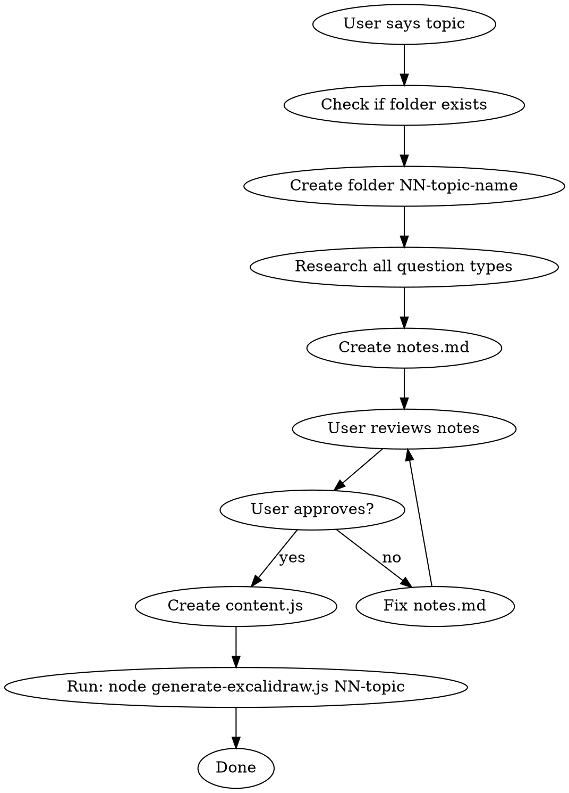

# Aptitude Cheatsheet Creator

Create comprehensive, exam-ready aptitude trick cheatsheets with visual Excalidraw diagrams. Covers all question types asked in competitive exams (SSC, Bank, CAT, GATE, placement tests).

## Workflow



**Step 1:** Create `notes.md` (full reference with visuals)
**Step 2:** User reviews → iterate until approved
**Step 3:** Create `content.js` (Excalidraw data)
**Step 4:** Run `node generate-excalidraw.js <folder>` from project root

## Project Structure

```
aptitude/
├── generate-excalidraw.js          # Reusable helper (at root)
├── NN-topic-name/
│   ├── notes.md                    # Full detailed cheatsheet
│   ├── content.js                  # Excalidraw generator data
│   └── topic-name.excalidraw       # Generated visual (auto)
```

Folder naming: `01-time-and-work`, `02-problems-on-trains`, etc. Sequential numbering.

## notes.md Structure

Every notes.md MUST follow this exact structure:

```markdown
# Topic Name - Aptitude Tricks Cheatsheet

---

## ALL FORMULAS AT A GLANCE

### Formula Group 1 Title

\```
┌─────────────────────────────────────────────────────────────────────┐
│                                                                     │
│  Formula 1                                                          │
│  Formula 2                                                          │
│                                                                     │
└─────────────────────────────────────────────────────────────────────┘
\```

### Formula Group 2 Title
(repeat boxed format)

---

## KEY CONCEPT — Visual Guide

\```
(ASCII diagrams explaining the core concept)
(Tree diagrams, flow diagrams, visual mnemonics)
\```

---

## Type N: Descriptive Title

**Q: Full question written clearly, not abbreviated.**

\```
(ASCII visual diagram for the problem)

Step-by-step solution
= answer ✓
\```

---

(repeat for all types)
```

## Question Type Coverage Checklist

**CRITICAL: Cover ALL commonly asked question types for the topic.** Check against these categories:

- Basic/direct formula application (Type 1-2 always)
- Reverse/find-the-unknown variations
- Two-scenario comparison problems
- Ratio-based shortcut problems
- Percentage-change variants
- Multi-step / phased problems (timelines)
- Special trick/shortcut formula problems
- "Trap" questions that test common mistakes
- Combined concept problems (mixing two sub-topics)

**Target: 10-22 types per topic.** Fewer means you're missing types. More means you might be splitting unnecessarily.

**After drafting, ask yourself:** "Is there a common exam question type for this topic that I haven't covered?" If yes, add it.

## Visual Diagram Rules

Every Type MUST have an ASCII visual diagram in the solution. Diagrams should help the reader **see** the problem, not just read it.

### Diagram Patterns by Topic Type

**Movement problems (trains, boats, time-distance):**
```
  ┌──────────────┐         ┌───────────────┐
  │ Train1 (150m) │ ────→  ←──── │ Train2 (200m)  │
  └──────────────┘              └───────────────┘
  |◄──────────── 350m ─────────────────────────►|
```

**Work/efficiency problems (time-work, pipes):**
```
         (60) ← Total Work
           |
     ------+------
     |            |
    (3)          (2)       ← Eff (3 + 2 = 5 units/day)
     |            |
   (10)         (15)       ← Days
     A            B
```

**Timeline/phase problems:**
```
|◄───── 10 days ─────►|◄──── 5 days ────►|
|   A + B (together)   |   A (alone)      |
|   Eff = 5/day        |   Eff = 2/day    |
|◄──── COMPLETED ─────►|◄── REMAINING ───►|
```

**Geometry/height-distance:**
```
       A (top)
       |\
       | \
    h  |  \ (hypotenuse)
       |   \
       |  θ \
       B─────C
         d
```

**Percentage/ratio bars:**
```
  |████████████████████░░░░░| 100%
  |◄──── 80% pass ───►|20% |
```

**Circular/clock problems:**
```
        12
    11      1
  10    ↗     2
   9   /   •   3
  8    ↘     4
    7       5
        6
```

### Efficiency Label Format

In tree diagrams, show combined efficiency on the same line:
```
← Eff (3 + 2 = 5 units/day)     ✓ CORRECT
← Eff (30/10=3, 30/15=2)        ✗ WRONG (don't show LCM division)
```

### LCM Calculation

Show LCM prime factorization ONLY ONCE in the KEY CONCEPT section. In Types, just write `LCM(10, 15) = 30` directly.

## content.js Structure

```js
module.exports = {
  title: "TOPIC NAME — APTITUDE TRICKS CHEATSHEET",

  formulas: [
    { title: "Group Name",
      color: "#1971c2", bg: "#d0ebff",
      text: "Formula 1\nFormula 2\n..." },
    // 3-6 formula boxes
  ],

  concept: {
    title: "KEY CONCEPT — ...",
    color: "#1864ab", bg: "#d0ebff",
    body: "Core concept explanation\n..."
  },

  types: [
    { num: "1", title: "Short Title",
      color: "#2f9e44", bg: "#ebfbee",
      q: "Short question (1 line max)",
      tree: "ASCII diagram\n\nSolution steps\n= answer ✓" },
    // all types
  ],

};
```

### Color Palette (cycle through these)

```
green:   color="#2f9e44"  bg="#ebfbee"  (or bg="#d8f5a2")
blue:    color="#1971c2"  bg="#d0ebff"
orange:  color="#e8590c"  bg="#fff4e6"
purple:  color="#7048e8"  bg="#e5dbff"
red:     color="#e03131"  bg="#ffe3e3"
darkred: color="#c92a2a"  bg="#fff5f5"
teal:    color="#0c8599"  bg="#c3fae8"
magenta: color="#862e9c"  bg="#f3d9fa"
amber:   color="#f08c00"  bg="#fff3bf"
```

Alternate colors across types for visual distinction. Related types (e.g., all pipe sub-types) can share a color family.

### content.js Rules

- `q` field: 1 line max, short clear question
- `tree` field: Full solution with ASCII diagram, max ~12 lines
- `traps`: Single string, each trap on new line with `\n`
- `qref`: Formatted table string with `│` separators
- No trailing commas in arrays
- Use `\n` for newlines in all string fields

## Generating Excalidraw

After content.js is created, run from project root:

```bash
node generate-excalidraw.js NN-topic-name
```

This reads `content.js` and generates the `.excalidraw` file automatically.

**If generate-excalidraw.js doesn't exist at root**, it needs to be created first. It's a reusable helper shared across all topics.

## Parallel Topic Creation

When creating multiple topics at once, use subagents:

```
For each topic → spawn Agent with:
  - Topic name and folder path
  - List of question types to cover
  - Color palette reference
  - notes.md + content.js structure
```

Then batch-generate all Excalidraws:
```bash
for dir in 04-topic 05-topic; do
  node generate-excalidraw.js "$dir"
done
```

## Quality Checklist

Before marking a topic as done:

- [ ] notes.md has ALL FORMULAS, KEY CONCEPT, Types, Traps, Quick Reference
- [ ] Every Type has a clear **Q:** with full question text (not abbreviated)
- [ ] Every Type has ASCII visual diagram in solution
- [ ] Efficiency/combined values shown in tree labels (not LCM divisions)
- [ ] LCM calculation shown only once (in KEY CONCEPT)
- [ ] No missing common exam question types
- [ ] Traps cover at least 6-8 common mistakes
- [ ] Quick Reference table covers all types
- [ ] content.js exports valid JS (test with `node -e "require('./content.js')"`)
- [ ] Excalidraw generated successfully
- [ ] Text visible in Excalidraw (proper width values)

## Common Mistakes

| Mistake | Fix |
|---------|-----|
| Abbreviated questions ("A 10d, B 15d") | Write full: "A can do work in 10 days, B in 15 days" |
| Missing diagram in Type solution | Every Type MUST have ASCII visual |
| Showing LCM division in every type | Show only `LCM(x,y) = z`, not the factorization |
| Too few types (< 10) | Research more exam question patterns |
| No traps section | Always include 6-8 common exam traps |
| content.js tree field too long | Keep under 12 lines, compress diagrams |
| Formula boxes without boxed borders | Use `┌─┐ │ │ └─┘` format in notes.md |
| Types without color variation | Cycle through 9 colors in palette |
