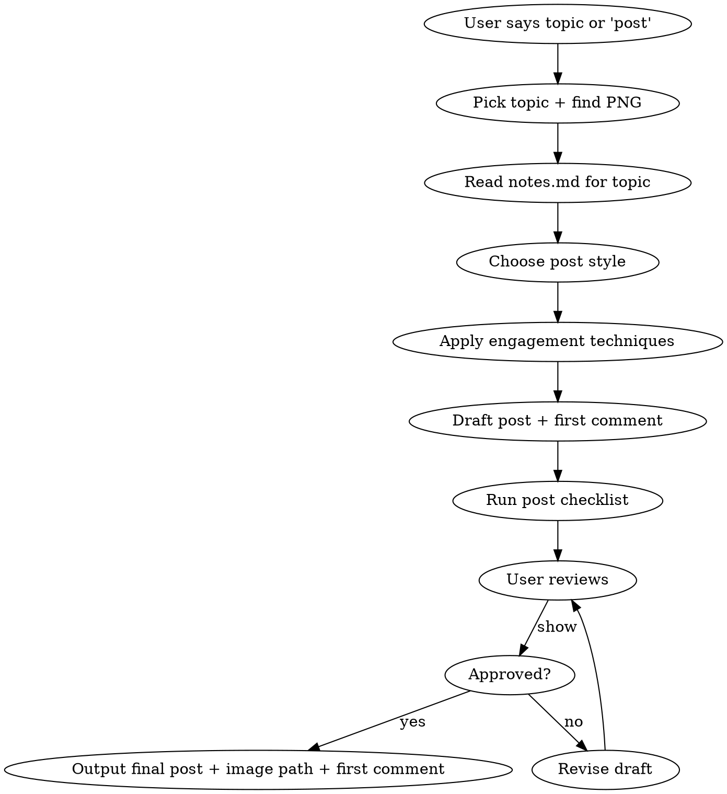

# LinkedIn Post Creator for Aptitude Cheatsheets

Create high-engagement LinkedIn posts for sharing aptitude trick cheatsheets with PNG images.

## Workflow



**Step 1:** Identify topic — user picks or ask which topic to post about
**Step 2:** Read the topic's `notes.md` to extract key formulas, tricks, and question types
**Step 3:** Choose a post style (see Post Styles)
**Step 4:** Apply engagement techniques from the Engagement Playbook
**Step 5:** Draft LinkedIn post text + first comment text
**Step 6:** Run post checklist, then user reviews and posts manually with the PNG image

## Project Stats (use in posts)

| Metric | Value |
|--------|-------|
| Total groups | 11 |
| Total topics | 37 |
| Formula boxes | 176 + 36 (master sheet) |
| Solved question types | 473 |
| Exams covered | SSC, Bank PO, CAT, GATE, Placements |

## PNG Image Locations

Images live in `_png-revision/` folder. Always tell the user the exact path to attach.

- Master sheet: `_png-revision/00-master-formula-cheatsheet.png`
- Per topic: `_png-revision/Group-NN-Name/topic-name.png`

---

## LinkedIn Algorithm — How It Works (data-backed)

Understanding the algorithm is key to maximizing reach. Source: Hootsuite 2024-2025 analysis.

### 3-Step Ranking Process

1. **Quality Filter:** Every post is classified as spam, low-quality, or high-quality by AI. Ambiguous posts go to human reviewers.
2. **Golden Hour Test:** Post is shown to a small slice of followers first. Performance in the **first 60 minutes** decides if it reaches 2nd/3rd degree connections.
3. **Relevance Ranking:** Three signals decide who sees your post:
   - **Identity:** Reader's profile (location, career, skills)
   - **Content signals:** Dwell time, engagement volume, topic relevance, comment quality
   - **Member activity:** Past engagement with your content and similar topics

### What the Algorithm Rewards

| Signal | Impact |
|--------|--------|
| **Dwell time** | Posts that keep users reading get more distribution |
| **Meaningful comments** | Thoughtful comments from relevant people >> generic reactions |
| **Topic authority** | Consistent posting on ONE topic builds creator authority |
| **Native content** | Text, images, carousels >> posts with external links |
| **Evergreen value** | High-quality posts can resurface for **2-3 weeks** |
| **Reply to comments** | LinkedIn boosts creators who actively participate in discussions |

### What the Algorithm Penalizes

| Penalty Trigger | Why |
|-----------------|-----|
| More than **5 hashtags** | Treated as spam signal |
| Posting more than **once per 12 hours** | Over-posting flag |
| **Engagement bait** ("Comment YES if you agree!") | Actively deprioritized |
| **External links** in post body | Reduces reach — put links in first comment instead |
| Tagging **unrelated people** | Spam signal |
| Posts riddled with **errors** | Quality signal drops |

---

## Content Format Performance (data-backed)

Based on Socialinsider study of **1.3 million LinkedIn posts** (2024-2025):

| Format | Avg Engagement Rate | Best For |
|--------|-------------------|----------|
| **Native document (PDF/carousel)** | **7.00%** (highest) | Cheatsheet series, multi-page guides |
| **Multi-image** | **6.45%** | Showing multiple topic cheatsheets |
| **Video** | **6.00%** | Trick explanations, walkthroughs |
| **Single image** | **5.30%** | One topic cheatsheet |
| **Text only** | **4.50%** | Quick tips, stories |
| **Poll** | **4.20%** | Audience research |
| **Link post** | **3.25%** (lowest) | Avoid — always hurts reach |

### Key Findings for Our Content

- **Multi-image posts drive most likes** across all page sizes under 50K followers
- **Image posts get 2x more comments** than text-only
- **India has 143M LinkedIn users** — our target audience is massive
- Pages posting weekly see **5.6x more follower growth**
- Posts with images get **2x higher comment rates**
- **Never put links in the post body** — always use first comment

### Recommended Format for Aptitude Cheatsheets

For accounts under 50K followers (most personal accounts):

1. **Best:** Multi-image post (attach 3-5 topic PNGs) — 6.45% engagement
2. **Great:** Single image post (one topic PNG) — 5.30% engagement
3. **Good:** Native document/carousel (if you convert PNGs to PDF) — 7.00% engagement
4. **Avoid:** Text-only or link posts

---

## Post Styles

### Style 1: Single Topic Deep Dive
Best for showcasing one topic's cheatsheet PNG.

### Style 2: "Did You Know" Hook
Lead with a surprising trick or shortcut from the notes, then reveal the cheatsheet.

### Style 3: Challenge Post
Post a tricky question from the notes, answer in comments or next slide.

### Style 4: Series Announcement
Announce the full cheatsheet collection with master formula sheet.

### Style 5: Before/After
Show the long textbook method vs. the 1-line trick from the cheatsheet.

### Style 6: Micro-Story
2-3 line personal anecdote about struggling with a topic, then the trick that changed everything.

### Style 7: Hot Take / Contrarian
Challenge a common study belief, back it up with a specific trick.

---

## Engagement Playbook

### The Golden Rule: Give Value BEFORE Asking

Every post must contain a usable trick, formula, or insight in the post itself.
Never post "check out my cheatsheet" without showing something from it first.
LinkedIn's algorithm checks if people stop scrolling on your post (dwell time).
A visible trick = longer dwell time = more reach.

### 1. Hook Engineering (first 2 lines = 80% of engagement)

LinkedIn truncates after ~210 chars. Your hook must create a **curiosity gap** that forces "...see more" clicks. Clicks = engagement signal = more distribution.

**Hook Patterns — ranked by engagement:**

| Pattern | Template | Why it works |
|---------|----------|--------------|
| Open Loop | "I solved 473 aptitude problems. Here's the one trick that kept showing up." | Creates curiosity gap — reader MUST click |
| Contrarian | "Stop memorizing formulas. Seriously." | Challenges belief — triggers disagreement clicks |
| Specific Number | "35^2 = 1225. I solved it in 2 seconds. No calculator." | Concrete proof invites "how?" reaction |
| Pain > Solution | "I used to spend 3 minutes on train problems. Now I spend 15 seconds." | Relatable struggle + transformation |
| Challenge | "90% of students get this wrong. Can you solve it in 10 seconds?" | Ego trigger — people MUST prove themselves |
| Bold Claim | "One diagram. 17 question types. Zero memorization." | Sounds too good — forces click to verify |

**Hook Rules:**
- First line: max 10-12 words. Punchy. Incomplete thought.
- Second line: creates the gap. Promises what comes next.
- NEVER start with "I'm excited to share" / "Happy to announce" / "Thrilled to"
- NEVER start with a hashtag or emoji
- Numbers beat adjectives: "473 problems" > "many problems"

### 2. Formatting for Mobile (85% of LinkedIn is mobile)

```
One line per thought.                    <- YES

Don't write dense paragraphs            <- NO
that go on for 3-4 lines because
nobody reads walls of text on mobile.
```

**Rules:**
- Max 1-2 lines per paragraph
- Blank line between every paragraph
- Use `->` or `-` for visual list breaks (not bullet points in first 3 lines)
- Strategic white space = readability = longer dwell time = more reach

### 3. Emoji Strategy (less is more)

**DO:** Use 1-3 emojis as visual anchors at section transitions
```
Here's what each cheatsheet covers:

-> All formulas with WHY they work
-> 10-19 solved question types
-> 1-line tricks that save 30+ seconds
-> Common traps that cost marks
```

**DON'T:** Emoji-spam every line. It screams "content farm" and reduces credibility.
Avoid overused emojis: rocket, fire, 100, clapping.

### 4. The "Save Trigger" (highest-value engagement signal)

LinkedIn's save/bookmark is a strong signal. Saves tell the algorithm "this is reference material" which means longer distribution window (up to 2-3 weeks).

Trigger saves explicitly:
```
Save this. You'll need it before your next exam.
```
```
Bookmark this post — come back during revision week.
```

### 5. CTA That Drives Comments (not just likes)

**Bad CTAs (generic, low effort):**
- "Thoughts?" / "Let me know what you think" / "Share if you agree"

**Good CTAs (specific, answerable, low barrier):**
- "Which topic should I cover next? Drop it below."
- "Can you solve this? Comment your answer."
- "What's your go-to shortcut for [topic]? I'll add the best ones."
- "Tag someone who's preparing for [exam name]."
- "What was the hardest aptitude topic for you?"

**Why specific CTAs win:** They lower the barrier. "Thoughts?" requires thinking. "Which topic?" requires typing one word. More comments = golden hour boost = more reach.

### 6. First Comment Strategy (critical for algorithm)

**ALWAYS draft a first comment** to post immediately after publishing.

Why first comment matters:
- Adds an early engagement signal during the golden hour
- Keeps the main post clean and hook-focused
- Place links, detailed breakdowns, and additional tricks here
- **NEVER put links in the main post** — algorithm penalizes external links

**First comment templates:**
```
Full breakdown of what's covered:
- Number System (5 sub-topics, 56 types)
- Average & Ages (26 types)
- Speed, Trains, Boats (48 types)
...

Follow me for the full series — one topic every week.
```

```
Quick trick from the cheatsheet:

35^2 = ?
Step 1: 3 x 4 = 12
Step 2: append 25
Answer: 1225

Works for ANY number ending in 5.
```

### 7. Social Proof Anchoring

Embed effort/scale numbers to build credibility:

- "I spent 3 weeks building this." (time invested)
- "473 problems across 37 topics." (volume)
- "Every formula includes WHY it works — not just what." (quality signal)
- "Covers SSC, Bank PO, CAT, GATE, and placement exams." (breadth)

### 8. Golden Hour Strategy (first 60 minutes after posting)

The first hour determines your post's fate. During this window:

1. **Reply to EVERY comment** within minutes — shows you're an active participant
2. **Ask follow-up questions** in replies — extends conversation threads
3. **Like every comment** — encourages more people to comment
4. Share the post to relevant groups or DM to friends who'd engage

### 9. Post Timing

Best times for Indian audience (exam/placement content):
- **Tue-Thu, 8-10 AM IST** — morning commute scrolling
- **Thu evening after 6 PM IST** — end of week study planning
- **Sun 10 AM-12 PM IST** — weekend study mode
- **Avoid:** Friday evenings, Saturday nights
- **Never** post twice within 12 hours (algorithm penalty)

### 10. Series Momentum & Topic Authority

LinkedIn rewards creators who consistently post about ONE topic. This builds "topic authority" and the algorithm boosts your posts to relevant audiences.

**Series tactics:**
- Post 1: "I'm dropping one cheatsheet every week. First up: [topic]"
- Each post: "This is post 3/37 in my aptitude series."
- Reference previous posts: "Last week's Time & Work post reached 500+ people."
- Posting weekly = **5.6x more follower growth** vs less frequent

### 11. Multi-Image Strategy (highest likes for < 50K followers)

Multi-image posts get the **most likes across all page sizes under 50K** (Socialinsider data).

For aptitude cheatsheets:
- Attach **3-5 related topic PNGs** in one post
- Group by theme: all Speed & Motion topics, all Ratio topics, etc.
- First image = most visually striking one
- Add "Swipe through all images" CTA in the post
- Order: easiest to hardest topic

---

## Post Structure Template

Every LinkedIn post MUST follow this structure:

```
[HOOK — 1-2 lines, under 210 chars, curiosity gap or pattern interrupt]

[BRIDGE — 1-2 lines, connect hook to value, personal context]

[VALUE — the core trick/formula/insight, 3-6 lines, give something usable]

[PROOF — 1-2 lines, numbers that validate your effort]

[SAVE TRIGGER — 1 line, "Save this" or "Bookmark this"]

[CTA — specific question or action, 1-2 lines]

[HASHTAGS — 3-5, on a new line]
```

## Hashtag Rules

- Use **3-5 hashtags** (more than 5 = spam signal, algorithm penalty)
- Mix broad reach + niche tags
- Place on last line, separated by spaces

**Broad reach:** #Aptitude #CompetitiveExams #MathTricks #QuantitativeAptitude #ExamPreparation
**Exam-specific:** #SSC #BankPO #CAT #GATE #PlacementPrep #CampusPlacement
**Niche:** #MathShortcuts #TricksAndTips #FormulasCheatsheet #VisualLearning #StudyNotes
**Community:** #StudyWithMe #ExamWarrior #LearnInPublic

## Writing Rules

- Write in first person, conversational tone
- No corporate jargon — "I'm thrilled to share" is a reach killer
- Sound like a friend sharing study notes, not a content marketer
- Mention that these are hand-crafted visual cheatsheets
- Include a specific trick or formula in the post itself (give value upfront)
- If the topic has a particularly clever shortcut, lead with that
- Write like you're texting a friend who's preparing for an exam
- **Never put external links in the post body** — first comment only

---

## Humanization Rules (critical — AI-sounding posts get ignored)

The biggest engagement killer is sounding like a template. LinkedIn users scroll past anything that feels "generated." Every post MUST pass the "would a real person actually say this?" test.

### What Makes Content Sound AI-Generated (avoid ALL of these)

| AI Pattern | Why It Fails | Human Alternative |
|------------|-------------|-------------------|
| Perfect parallel structure ("X. Y. Z.") | Too polished, nobody talks like that | Mix up sentence lengths, break the pattern |
| "Here's the thing" / "Let me explain" | Overused AI filler phrases | Just say the thing directly |
| "Here's what I learned" after every hook | Robotic pattern, readers recognize it | Vary your bridge — sometimes skip it entirely |
| Perfectly formatted lists with `->` everywhere | Looks like a template | Mix prose and lists, use lists only for scannable info |
| Every paragraph is exactly 1-2 lines | Suspicious uniformity | Let some paragraphs breathe — 3 lines is fine sometimes |
| "Not a X, but a Y" construction | Classic AI framing | Just describe what it is |
| Ending every post with a question | Predictable pattern | Sometimes end with a statement — confidence is engaging |
| "Let that sink in" / "Read that again" | Overused LinkedIn clichés | Cut it. If it's powerful, people will re-read on their own |
| Overly clean, zero-flaw writing | Real people make small imperfections | Use contractions, fragments, casual asides |
| "Here's a quick trick" every time | Repetitive intro | Jump straight into the trick — no announcement needed |

### How to Sound Human

**1. Write messy first, clean later**
Draft like you're explaining to a friend on WhatsApp. Then remove only what's confusing — keep the casual tone.

**2. Use contractions and fragments**
```
# AI-sounding:
"I have created a collection of 37 visual cheatsheets."

# Human:
"I made 37 visual cheatsheets. Took me weeks honestly."
```

**3. Add personal texture (not fake stories)**
Don't invent struggles. Use real feelings:
- "this one genuinely surprised me"
- "I kept getting this wrong until I saw the pattern"
- "honestly didn't expect this to take so long"
- "figured I'd share since I already made it for myself"

**4. Be specific, not polished**
```
# AI-sounding:
"Each cheatsheet contains comprehensive formulas with derivations."

# Human:
"Each cheatsheet has every formula I could find — plus WHY each one works,
because I kept forgetting formulas I didn't understand."
```

**5. Vary your rhythm**
Mix short punchy lines with longer flowing ones. Don't make everything a one-liner.
```
# Monotonous (AI pattern):
"37 topics. 176 formulas. 473 problems. One collection."

# Human rhythm:
"37 topics and 176 formulas — I went through 473 problems to pull out
every trick that actually saves time in an exam."
```

**6. Use casual connectors**
"honestly" / "turns out" / "the thing is" / "so basically" / "ngl" / "funny thing is"
These signal a real person thinking out loud, not a template generating text.

**7. Don't over-structure the value section**
Instead of a perfect formatted list of benefits, sometimes just... talk about it.
```
# Template-y:
"-> All formulas with WHY they work
-> 10-19 solved question types
-> 1-line tricks that save 30+ seconds"

# Human:
"Every formula has the derivation so you actually remember it.
And each topic has 10-19 solved questions — not textbook style,
but the shortcut way that saves you 30+ seconds."
```

**8. Let your personality leak through**
It's okay to be a little opinionated, a little funny, a little frustrated.
Personality > perfection for engagement.

### Humanization Checklist (run after drafting)

- [ ] Read the post out loud — does it sound like something you'd actually say?
- [ ] No more than 2 sentences in a row with the same structure
- [ ] At least one casual/informal phrase ("honestly", "turns out", etc.)
- [ ] No AI clichés ("here's the thing", "let that sink in", "read that again")
- [ ] Has at least one imperfect/vulnerable/real moment
- [ ] Doesn't feel like filling in a template — each post feels different
- [ ] The hook sounds like a thought, not a headline

---

## Example Post (Style 2 — "Did You Know")

```
Time & Work problems used to eat up 3-4 minutes of my exam time.

Then someone showed me the LCM trick and I felt stupid
for not seeing it earlier.

A does a job in 10 days. B in 15 days. How long together?

Forget the fraction method. Just do this:

Total work = LCM(10, 15) = 30 units
A does 3 units/day. B does 2. Together that's 5.
30 / 5 = 6 days. Done.

No fractions anywhere. I honestly don't know why textbooks
don't teach it this way from the start.

I made a visual cheatsheet with 17 types of Time & Work problems —
each one solved the shortcut way with a diagram.

Save this if you have an exam coming up.

What's the one aptitude topic that always slows you down?

#Aptitude #MathTricks #TimeAndWork #CompetitiveExams #StudyNotes
```

**First comment:**
```
One more from the same cheatsheet —

A and B together finish a job in 6 days. A alone takes 10 days.
How long for B alone?

1/B = 1/6 - 1/10 = 1/15
So B = 15 days.

Once you see this pattern, these problems take 20 seconds flat.

The cheatsheet covers 17 types like this. I'll be sharing
one topic every week — follow along if that's useful.
```

## Example Post (Style 3 — Challenge)

```
Genuinely curious — can you solve this without a calculator?

A train 200m long crosses a platform 300m long in 25 seconds.
What's the speed?

I used to start by converting units and writing everything out.
Turns out there's a one-line formula for this:

Speed = (train length + platform length) / time
= 500 / 25 = 20 m/s = 72 km/h

That's it. The whole thing takes 10 seconds once you know the trick.

I went through 19 types of train problems and pulled out
shortcuts like this for each one. Made it into a visual cheatsheet
so you can revise the whole thing in one look.

Comment your answer — curious how many of you got 72 km/h.

#ProblemsOnTrains #Aptitude #MathShortcuts #ExamPreparation #SSC
```

## Example Post (Style 4 — Series Announcement)

```
I went through 473 aptitude problems over the last few weeks.

Not gonna lie — it took way longer than I expected. But the
interesting thing is, most of these problems boil down to
the same handful of tricks used in different ways.

So I turned everything into visual cheatsheets.

One diagram per topic. Every formula with the derivation
(because I kept forgetting the ones I didn't understand).
And 10-19 solved questions per topic — shortcut way, not
the textbook 5-step method.

It covers pretty much everything that shows up in SSC,
Bank PO, CAT, GATE, and placement aptitude rounds:

Number System, Average, Ages, Trains, Boats, Time & Work,
Percentage, Ratio, Profit & Loss, Interest, Probability,
Permutation, Clock, Calendar, Geometry, and 8 Logical
Reasoning topics.

37 topics total. 176 formulas.

Quick example from the collection:

What's 35 squared?
3 x 4 = 12, stick 25 at the end. 1225.
Works for every number ending in 5. Try 85 — you'll get 7225.

I'll start sharing one topic per week from next week.

Bookmark this so you can come back when revision time hits.

Which topic would be most useful for you right now?

#Aptitude #CompetitiveExams #MathTricks #QuantitativeAptitude #LearnInPublic
```

**First comment:**
```
Since a few people asked — here's what's in each group:

Number System — 56 problems across 5 sub-topics
Average & Ages — 26 problems
Speed, Trains, Boats — 48 problems
Time & Work, Pipes — 27 problems
Ratio, Percentage, Partnership — 71 problems
Profit & Loss, Discount — 22 problems
Simple & Compound Interest — 29 problems
Permutation & Probability — 31 problems
Clock & Calendar — 23 problems
Geometry (Area, Volume, Heights) — 41 problems
Logical Reasoning — 87 problems across 8 sub-topics

Every question has a visual diagram + shortcut solution.

I originally made these for my own revision but figured
they might help others too. Will share one topic a week.
```

---

## Post Checklist

Before finalizing any post:

- [ ] Hook is under 210 characters and creates curiosity gap
- [ ] Post gives actual value (a trick, formula, or insight) upfront
- [ ] Includes specific numbers (types covered, problems solved)
- [ ] One thought per line, blank lines between paragraphs (mobile-friendly)
- [ ] Has a save trigger ("Save this", "Bookmark this")
- [ ] Has a specific CTA question (not generic "thoughts?")
- [ ] 3-5 hashtags (not more — algorithm penalty)
- [ ] **No external links in post body** (use first comment)
- [ ] PNG image path provided to user for manual upload
- [ ] Total length 800-1300 characters
- [ ] No corporate tone ("excited to share", "thrilled", "happy to announce")
- [ ] Sounds like a peer sharing notes, not a brand posting content
- [ ] First comment drafted with additional value or trick
- [ ] Max 1-3 emojis, used as visual anchors only (no rocket/fire/100)
- [ ] Planned for optimal time (Tue-Thu 8-10 AM IST or Sun morning)
- [ ] **Humanization:** Read out loud — sounds like something you'd actually say
- [ ] **Humanization:** No more than 2 sentences in a row with same structure
- [ ] **Humanization:** Has at least one casual phrase ("honestly", "turns out", "ngl")
- [ ] **Humanization:** No AI clichés ("here's the thing", "let that sink in", "read that again")
- [ ] **Humanization:** Has a real/personal moment — not a manufactured story
- [ ] **Humanization:** Doesn't feel like a filled-in template

## Sources

Data and best practices sourced from:
- Hootsuite LinkedIn Algorithm Analysis 2024-2025
- Socialinsider LinkedIn Benchmarks Study (1.3M posts, 16,645 pages, Jan 2024-Dec 2025)
- Hootsuite LinkedIn Statistics for Business 2024-2025
