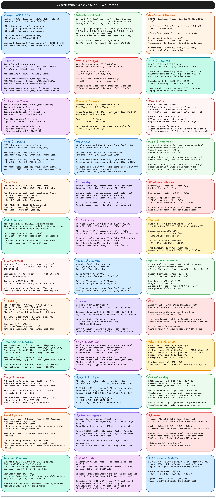

# Aptitude Tricks Cheatsheet

Visual cheatsheets for competitive exam aptitude preparation (SSC, Bank PO, CAT, placements). Every topic is an interactive [Excalidraw](https://excalidraw.com/) diagram with formula cards, solved examples, and ASCII visual aids.

## Stats

| Metric | Count |
|--------|-------|
| Groups | 11 |
| Topics | 37 |
| Formula boxes | 176 + 36 (master sheet) |
| Solved question types | 473 |

## How to Use

1. **Quick revision (PNG)** — Browse [`_png-revision/`](_png-revision/) folder for instant visual review
2. **Master formula sheet** — [PNG](_png-revision/00-master-formula-cheatsheet.png) | [Excalidraw](_global/master-formula-cheatsheet.excalidraw)
3. **Topic deep-dive** — Open any topic's `.excalidraw` file from the tables below
4. **Read notes** — Each topic has a `notes.md` with detailed explanations

Each question is solved with:
- **LOGIC** — Step-by-step reasoning
- **TRICK** — Shortcut formula for speed
- **Diagram** — ASCII visual to build intuition

Each formula box includes:
- The formula itself
- **WHY** — How the formula is derived
- **Ex** — One simple numeric example

## Topics

### Group 01 — Number System (5 topics)
| Topic | Types | PNG | Excalidraw | Notes |
|-------|-------|-----|------------|-------|
| [Problems on Numbers](Group-01-Number-System/problems-on-numbers/) | 12 | [png](_png-revision/Group-01-Number-System/problems-on-numbers.png) | [excalidraw](Group-01-Number-System/problems-on-numbers/problems-on-numbers.excalidraw) | [notes](Group-01-Number-System/problems-on-numbers/notes.md) |
| [Powers and Roots](Group-01-Number-System/powers-and-roots/) | 15 | [png](_png-revision/Group-01-Number-System/powers-and-roots.png) | [excalidraw](Group-01-Number-System/powers-and-roots/powers-and-roots.excalidraw) | [notes](Group-01-Number-System/powers-and-roots/notes.md) |
| [Simplification](Group-01-Number-System/simplification/) | 7 | [png](_png-revision/Group-01-Number-System/simplification.png) | [excalidraw](Group-01-Number-System/simplification/simplification.excalidraw) | [notes](Group-01-Number-System/simplification/notes.md) |
| [HCF and LCM](Group-01-Number-System/hcf-and-lcm/) | 12 | [png](_png-revision/Group-01-Number-System/hcf-and-lcm.png) | [excalidraw](Group-01-Number-System/hcf-and-lcm/hcf-and-lcm.excalidraw) | [notes](Group-01-Number-System/hcf-and-lcm/notes.md) |
| [Fractions and Decimals](Group-01-Number-System/fractions-and-decimals/) | 10 | [png](_png-revision/Group-01-Number-System/fractions-and-decimals.png) | [excalidraw](Group-01-Number-System/fractions-and-decimals/fractions-and-decimals.excalidraw) | [notes](Group-01-Number-System/fractions-and-decimals/notes.md) |

### Group 02 — Average (2 topics)
| Topic | Types | PNG | Excalidraw | Notes |
|-------|-------|-----|------------|-------|
| [Average](Group-02-Average/average/) | 14 | [png](_png-revision/Group-02-Average/average.png) | [excalidraw](Group-02-Average/average/average.excalidraw) | [notes](Group-02-Average/average/notes.md) |
| [Problem on Ages](Group-02-Average/problem-on-ages/) | 12 | [png](_png-revision/Group-02-Average/problem-on-ages.png) | [excalidraw](Group-02-Average/problem-on-ages/problem-on-ages.excalidraw) | [notes](Group-02-Average/problem-on-ages/notes.md) |

### Group 03 — Speed and Motion (3 topics)
| Topic | Types | PNG | Excalidraw | Notes |
|-------|-------|-----|------------|-------|
| [Time and Distance](Group-03-Speed-and-Motion/time-and-distance/) | 17 | [png](_png-revision/Group-03-Speed-and-Motion/time-and-distance.png) | [excalidraw](Group-03-Speed-and-Motion/time-and-distance/time-and-distance.excalidraw) | [notes](Group-03-Speed-and-Motion/time-and-distance/notes.md) |
| [Problems on Trains](Group-03-Speed-and-Motion/problems-on-trains/) | 19 | [png](_png-revision/Group-03-Speed-and-Motion/problems-on-trains.png) | [excalidraw](Group-03-Speed-and-Motion/problems-on-trains/problems-on-trains.excalidraw) | [notes](Group-03-Speed-and-Motion/problems-on-trains/notes.md) |
| [Boats and Streams](Group-03-Speed-and-Motion/boats-and-streams/) | 12 | [png](_png-revision/Group-03-Speed-and-Motion/boats-and-streams.png) | [excalidraw](Group-03-Speed-and-Motion/boats-and-streams/boats-and-streams.excalidraw) | [notes](Group-03-Speed-and-Motion/boats-and-streams/notes.md) |

### Group 04 — Work and Time (2 topics)
| Topic | Types | PNG | Excalidraw | Notes |
|-------|-------|-----|------------|-------|
| [Time and Work](Group-04-Work-and-Time/time-and-work/) | 17 | [png](_png-revision/Group-04-Work-and-Time/time-and-work.png) | [excalidraw](Group-04-Work-and-Time/time-and-work/time-and-work.excalidraw) | [notes](Group-04-Work-and-Time/time-and-work/notes.md) |
| [Pipes and Cisterns](Group-04-Work-and-Time/pipes-and-cisterns/) | 10 | [png](_png-revision/Group-04-Work-and-Time/pipes-and-cisterns.png) | [excalidraw](Group-04-Work-and-Time/pipes-and-cisterns/pipes-and-cisterns.excalidraw) | [notes](Group-04-Work-and-Time/pipes-and-cisterns/notes.md) |

### Group 05 — Ratio and Proportion (6 topics)
| Topic | Types | PNG | Excalidraw | Notes |
|-------|-------|-----|------------|-------|
| [Percentage](Group-05-Ratio-and-Proportion/percentage/) | 14 | [png](_png-revision/Group-05-Ratio-and-Proportion/percentage.png) | [excalidraw](Group-05-Ratio-and-Proportion/percentage/percentage.excalidraw) | [notes](Group-05-Ratio-and-Proportion/percentage/notes.md) |
| [Ratio and Proportion](Group-05-Ratio-and-Proportion/ratio-and-proportion/) | 17 | [png](_png-revision/Group-05-Ratio-and-Proportion/ratio-and-proportion.png) | [excalidraw](Group-05-Ratio-and-Proportion/ratio-and-proportion/ratio-and-proportion.excalidraw) | [notes](Group-05-Ratio-and-Proportion/ratio-and-proportion/notes.md) |
| [Chain Rule](Group-05-Ratio-and-Proportion/chain-rule/) | 10 | [png](_png-revision/Group-05-Ratio-and-Proportion/chain-rule.png) | [excalidraw](Group-05-Ratio-and-Proportion/chain-rule/chain-rule.excalidraw) | [notes](Group-05-Ratio-and-Proportion/chain-rule/notes.md) |
| [Partnership](Group-05-Ratio-and-Proportion/partnership/) | 10 | [png](_png-revision/Group-05-Ratio-and-Proportion/partnership.png) | [excalidraw](Group-05-Ratio-and-Proportion/partnership/partnership.excalidraw) | [notes](Group-05-Ratio-and-Proportion/partnership/notes.md) |
| [Alligation and Mixture](Group-05-Ratio-and-Proportion/alligation-and-mixture/) | 12 | [png](_png-revision/Group-05-Ratio-and-Proportion/alligation-and-mixture.png) | [excalidraw](Group-05-Ratio-and-Proportion/alligation-and-mixture/alligation-and-mixture.excalidraw) | [notes](Group-05-Ratio-and-Proportion/alligation-and-mixture/notes.md) |
| [Work and Wages](Group-05-Ratio-and-Proportion/work-and-wages/) | 8 | [png](_png-revision/Group-05-Ratio-and-Proportion/work-and-wages.png) | [excalidraw](Group-05-Ratio-and-Proportion/work-and-wages/work-and-wages.excalidraw) | [notes](Group-05-Ratio-and-Proportion/work-and-wages/notes.md) |

### Group 06 — Profit and Commerce (2 topics)
| Topic | Types | PNG | Excalidraw | Notes |
|-------|-------|-----|------------|-------|
| [Profit and Loss](Group-06-Profit-and-Commerce/profit-and-loss/) | 12 | [png](_png-revision/Group-06-Profit-and-Commerce/profit-and-loss.png) | [excalidraw](Group-06-Profit-and-Commerce/profit-and-loss/profit-and-loss.excalidraw) | [notes](Group-06-Profit-and-Commerce/profit-and-loss/notes.md) |
| [Discount](Group-06-Profit-and-Commerce/discount/) | 10 | [png](_png-revision/Group-06-Profit-and-Commerce/discount.png) | [excalidraw](Group-06-Profit-and-Commerce/discount/discount.excalidraw) | [notes](Group-06-Profit-and-Commerce/discount/notes.md) |

### Group 07 — Interest (2 topics)
| Topic | Types | PNG | Excalidraw | Notes |
|-------|-------|-----|------------|-------|
| [Simple Interest](Group-07-Interest/simple-interest/) | 14 | [png](_png-revision/Group-07-Interest/simple-interest.png) | [excalidraw](Group-07-Interest/simple-interest/simple-interest.excalidraw) | [notes](Group-07-Interest/simple-interest/notes.md) |
| [Compound Interest](Group-07-Interest/compound-interest/) | 15 | [png](_png-revision/Group-07-Interest/compound-interest.png) | [excalidraw](Group-07-Interest/compound-interest/compound-interest.excalidraw) | [notes](Group-07-Interest/compound-interest/notes.md) |

### Group 08 — Probability and Counting (2 topics)
| Topic | Types | PNG | Excalidraw | Notes |
|-------|-------|-----|------------|-------|
| [Permutation and Combination](Group-08-Probability-and-Counting/permutation-and-combination/) | 16 | [png](_png-revision/Group-08-Probability-and-Counting/permutation-and-combination.png) | [excalidraw](Group-08-Probability-and-Counting/permutation-and-combination/permutation-and-combination.excalidraw) | [notes](Group-08-Probability-and-Counting/permutation-and-combination/notes.md) |
| [Probability](Group-08-Probability-and-Counting/probability/) | 15 | [png](_png-revision/Group-08-Probability-and-Counting/probability.png) | [excalidraw](Group-08-Probability-and-Counting/probability/probability.excalidraw) | [notes](Group-08-Probability-and-Counting/probability/notes.md) |

### Group 09 — Clock and Calendar (2 topics)
| Topic | Types | PNG | Excalidraw | Notes |
|-------|-------|-----|------------|-------|
| [Calendar](Group-09-Clock-and-Calendar/calendar/) | 11 | [png](_png-revision/Group-09-Clock-and-Calendar/calendar.png) | [excalidraw](Group-09-Clock-and-Calendar/calendar/calendar.excalidraw) | [notes](Group-09-Clock-and-Calendar/calendar/notes.md) |
| [Clock](Group-09-Clock-and-Calendar/clock/) | 12 | [png](_png-revision/Group-09-Clock-and-Calendar/clock.png) | [excalidraw](Group-09-Clock-and-Calendar/clock/clock.excalidraw) | [notes](Group-09-Clock-and-Calendar/clock/notes.md) |

### Group 10 — Geometry (3 topics)
| Topic | Types | PNG | Excalidraw | Notes |
|-------|-------|-----|------------|-------|
| [Area](Group-10-Geometry/area/) | 16 | [png](_png-revision/Group-10-Geometry/area.png) | [excalidraw](Group-10-Geometry/area/area.excalidraw) | [notes](Group-10-Geometry/area/notes.md) |
| [Height and Distance](Group-10-Geometry/height-and-distance/) | 12 | [png](_png-revision/Group-10-Geometry/height-and-distance.png) | [excalidraw](Group-10-Geometry/height-and-distance/height-and-distance.excalidraw) | [notes](Group-10-Geometry/height-and-distance/notes.md) |
| [Volume and Surface Area](Group-10-Geometry/volume-and-surface-area/) | 13 | [png](_png-revision/Group-10-Geometry/volume-and-surface-area.png) | [excalidraw](Group-10-Geometry/volume-and-surface-area/volume-and-surface-area.excalidraw) | [notes](Group-10-Geometry/volume-and-surface-area/notes.md) |

### Group 11 — Logical Reasoning (8 topics)
| Topic | Types | PNG | Excalidraw | Notes |
|-------|-------|-----|------------|-------|
| [Races and Games](Group-11-Logical-Reasoning/races-and-games/) | 12 | [png](_png-revision/Group-11-Logical-Reasoning/races-and-games.png) | [excalidraw](Group-11-Logical-Reasoning/races-and-games/races-and-games.excalidraw) | [notes](Group-11-Logical-Reasoning/races-and-games/notes.md) |
| [Series Completion](Group-11-Logical-Reasoning/series-completion/) | 15 | [png](_png-revision/Group-11-Logical-Reasoning/series-completion.png) | [excalidraw](Group-11-Logical-Reasoning/series-completion/series-completion.excalidraw) | [notes](Group-11-Logical-Reasoning/series-completion/notes.md) |
| [Coding-Decoding](Group-11-Logical-Reasoning/coding-decoding/) | 12 | [png](_png-revision/Group-11-Logical-Reasoning/coding-decoding.png) | [excalidraw](Group-11-Logical-Reasoning/coding-decoding/coding-decoding.excalidraw) | [notes](Group-11-Logical-Reasoning/coding-decoding/notes.md) |
| [Blood Relations](Group-11-Logical-Reasoning/blood-relations/) | 12 | [png](_png-revision/Group-11-Logical-Reasoning/blood-relations.png) | [excalidraw](Group-11-Logical-Reasoning/blood-relations/blood-relations.excalidraw) | [notes](Group-11-Logical-Reasoning/blood-relations/notes.md) |
| [Seating Arrangement](Group-11-Logical-Reasoning/seating-arrangement/) | 12 | [png](_png-revision/Group-11-Logical-Reasoning/seating-arrangement.png) | [excalidraw](Group-11-Logical-Reasoning/seating-arrangement/seating-arrangement.excalidraw) | [notes](Group-11-Logical-Reasoning/seating-arrangement/notes.md) |
| [Syllogisms](Group-11-Logical-Reasoning/syllogisms/) | 12 | [png](_png-revision/Group-11-Logical-Reasoning/syllogisms.png) | [excalidraw](Group-11-Logical-Reasoning/syllogisms/syllogisms.excalidraw) | [notes](Group-11-Logical-Reasoning/syllogisms/notes.md) |
| [Direction Problems](Group-11-Logical-Reasoning/direction-problems/) | 12 | [png](_png-revision/Group-11-Logical-Reasoning/direction-problems.png) | [excalidraw](Group-11-Logical-Reasoning/direction-problems/direction-problems.excalidraw) | [notes](Group-11-Logical-Reasoning/direction-problems/notes.md) |
| [Logical Puzzles](Group-11-Logical-Reasoning/logical-puzzles/) | 12 | [png](_png-revision/Group-11-Logical-Reasoning/logical-puzzles.png) | [excalidraw](Group-11-Logical-Reasoning/logical-puzzles/logical-puzzles.excalidraw) | [notes](Group-11-Logical-Reasoning/logical-puzzles/notes.md) |

## Project Structure

```
aptitude/
├── _global/                          # Master formula cheatsheet (all topics)
│   ├── content.js
│   └── master-formula-cheatsheet.excalidraw
├── _png-revision/                    # PNG images for quick revision
│   ├── 00-master-formula-cheatsheet.png
│   ├── Group-01-Number-System/
│   │   ├── problems-on-numbers.png
│   │   └── ...
│   └── ...
├── generate-excalidraw.js            # Excalidraw generator
├── generate-png.js                   # PNG generator
├── Group-01-Number-System/
│   ├── problems-on-numbers/
│   │   ├── notes.md                  # Detailed notes
│   │   ├── content.js                # Structured data (formulas + types)
│   │   └── problems-on-numbers.excalidraw  # Visual cheatsheet
│   └── ...
└── ...
```

Each topic folder contains:
- **`notes.md`** — Detailed reference notes with explanations
- **`content.js`** — Structured data: formulas array + question types array
- **`topic-name.excalidraw`** — Generated visual cheatsheet

## Regenerating Files

```bash
# Regenerate excalidraw + PNG for a single topic
node generate-excalidraw.js Group-03-Speed-and-Motion/problems-on-trains
node generate-png.js Group-03-Speed-and-Motion/problems-on-trains

# Regenerate all PNGs
node generate-png.js --all

# Master sheet
node generate-excalidraw.js _global
```

## Content Format

Each `content.js` exports:

```js
module.exports = {
  title: "TOPIC NAME — APTITUDE TRICKS CHEATSHEET",
  formulas: [
    { title: "Formula Box Title", color: "#hex", bg: "#hex",
      text: "Formula text with derivation and example" }
  ],
  types: [
    { num: "1", title: "Question Type", color: "#hex", bg: "#hex",
      q: "Full question sentence",
      tree: "LOGIC:\nStep-by-step\n\nTRICK:\nShortcut\n\nASCII diagram\n\nAnswer: result" }
  ]
};
```

## Master Formula Cheatsheet


